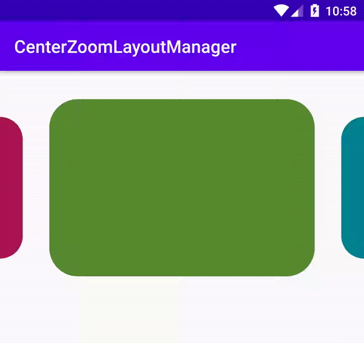

# CenterZoomLinearLayoutManager
[](https://jitpack.io/#hamedsj/CenterZoomLinearLayoutManager)
[](https://opensource.org/licenses/Apache-2.0)

A LinearLayoutManager with ability to zoom center child



## Usage
1.Add CenterZoomLinearLayoutManager's dependency into your `build.gradle` file
```gradle
dependencies {
  implementation 'com.github.hamedsj:CenterZoomLinearLayoutManager:0.0.1'
}
```

2.Use CenterZoomLinearLayoutManager as LayoutManager of RecyclerView
```java
//Initialize instance of centerZoomLinearLayoutManager
CenterZoomLinearLayoutManager myLayoutManager = new CenterZoomLinearLayoutManager(getApplicationContext())

//Change maximum distance of item to return to (1 - MinScale)x of it's size by percentage of width/height of recyclerView
//Default PercentDiffFromCenter is 0.8
myLayoutManager.setPercentDiffFromCenter(0.4f);

//Change MinScale
//Default MinScale is 0.1
myLayoutManager.setMinScale(0.2f);

//Set layoutManager for recyclerView
yourRecyclerView.setLayoutManager(myLayoutManager);
```

## License
Copyright 2020 Shajaravi Hamid-Reza

Licensed under the Apache License, Version 2.0 (the "License");
you may not use this file except in compliance with the License.
You may obtain a copy of the License at

    http://www.apache.org/licenses/LICENSE-2.0
    
Unless required by applicable law or agreed to in writing, software
distributed under the License is distributed on an "AS IS" BASIS,
WITHOUT WARRANTIES OR CONDITIONS OF ANY KIND, either express or implied.
See the License for the specific language governing permissions and
limitations under the License.
